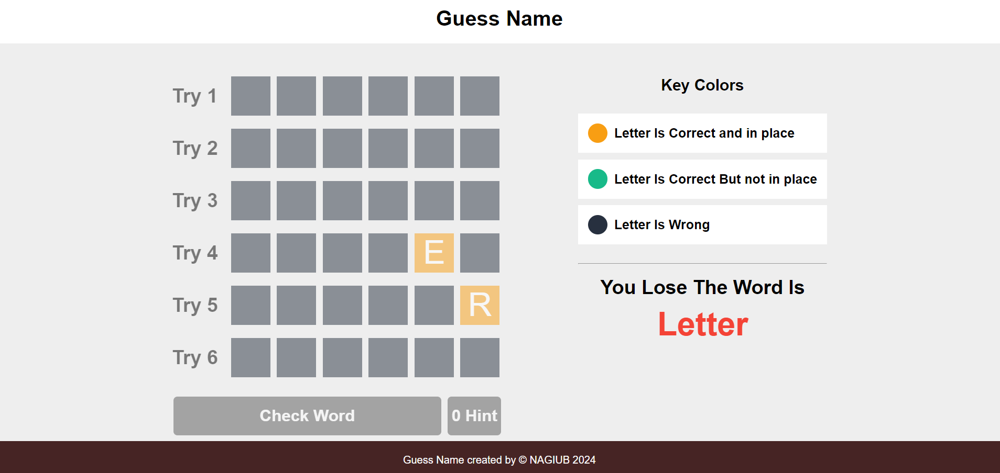
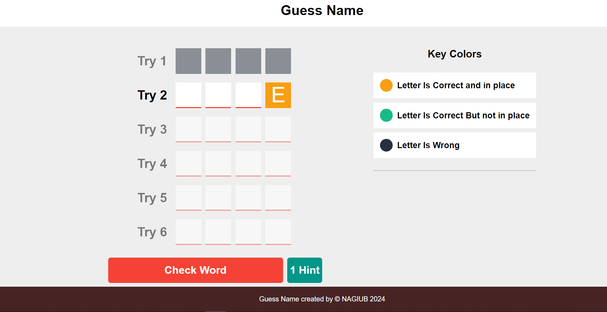
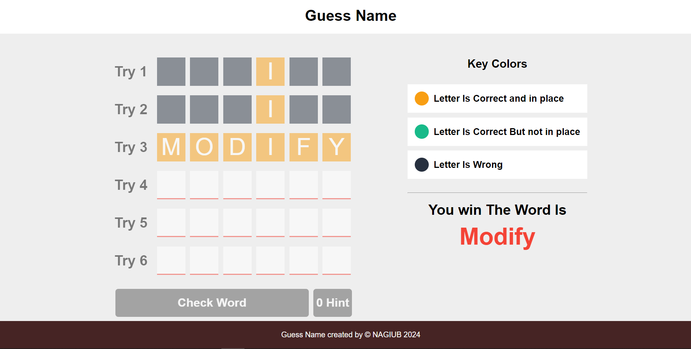

# Guess Game
## Table of contents

- [Overview](#overview)
  - [The challenge](#the-challenge)
  - [Screenshot](#screenshot)
  - [Built with](#built-with)
- [Author](#author)

## Overview
create a guess game with js 
### The challenge

Guess Game:
- guess words with different length.
- you have to hints to guess the word
- you have 6 tries to get the right word
- after 6 tries you lose

### Screenshot

### Built with

- Semantic HTML5 markup
- CSS custom properties
- Flexbox
- CSS Grid
- Sweet Alert
- JS
## Author

- Website - [Ahmed Nagiub](https://ahmadnagiub.github.io/portfolio/)
- Frontend Mentor - [@AhmadNagiub](https://www.frontendmentor.io/profile/AhmadNagiub)
- linked in - [@ahmed-nagiub33](https://www.linkedin.com/in/ahmed-nagiub33/)
- Live Site - [@Demo](ahmadnagiub.github.io/Guess-game/)
